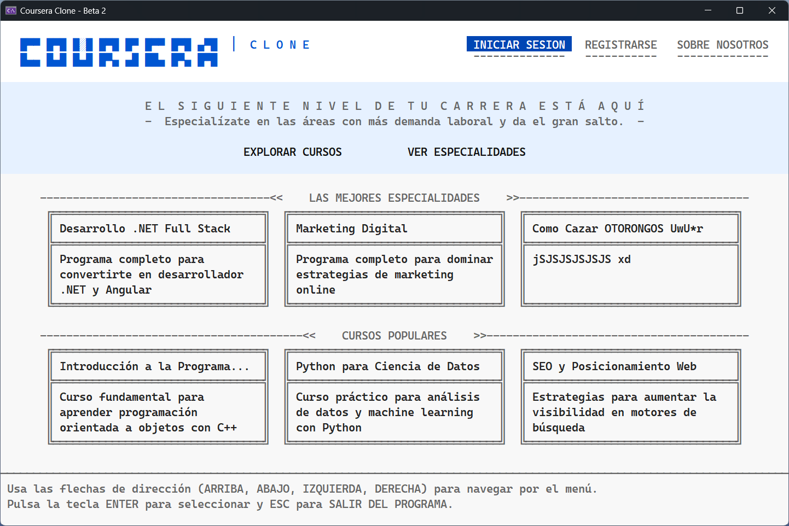
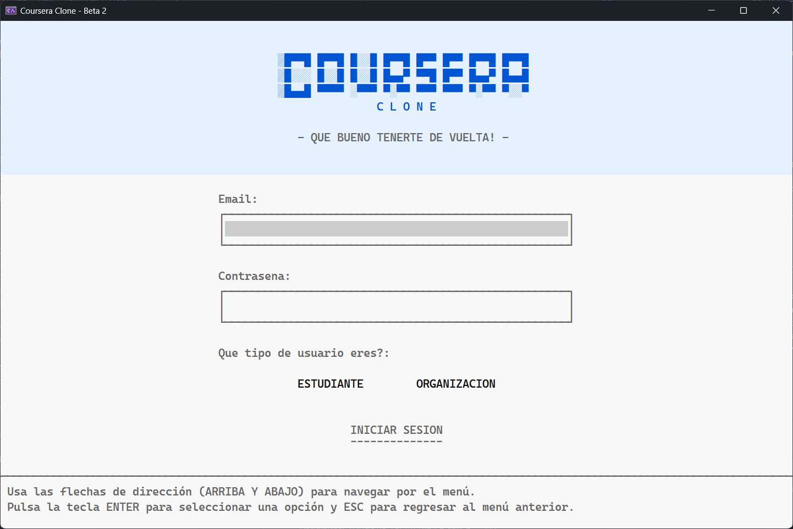
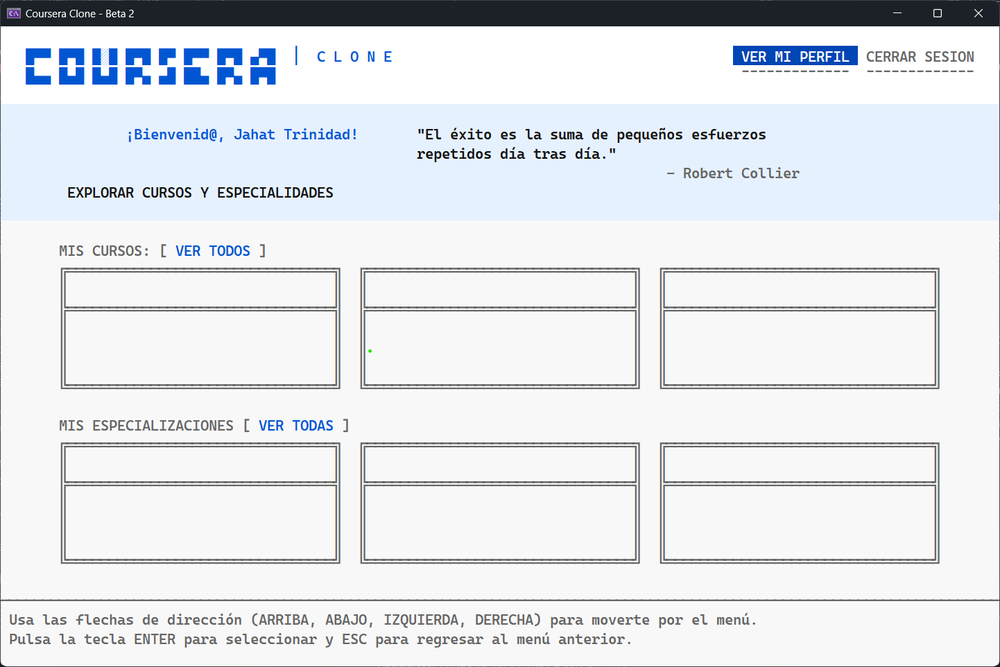
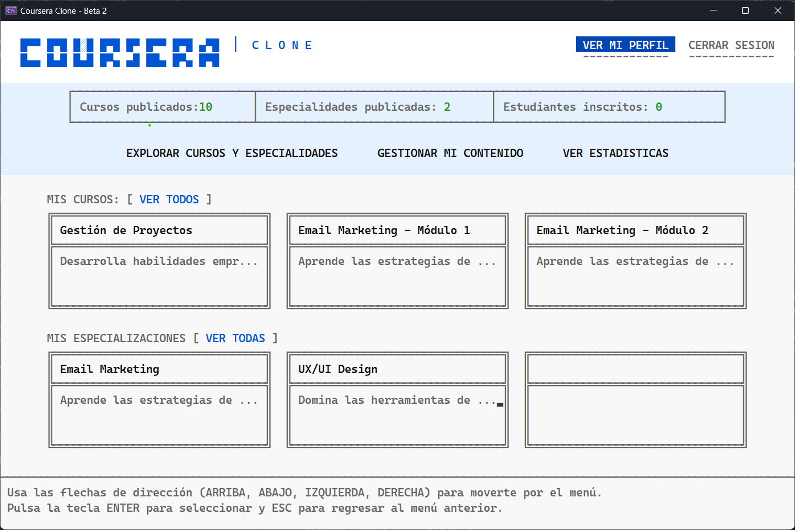
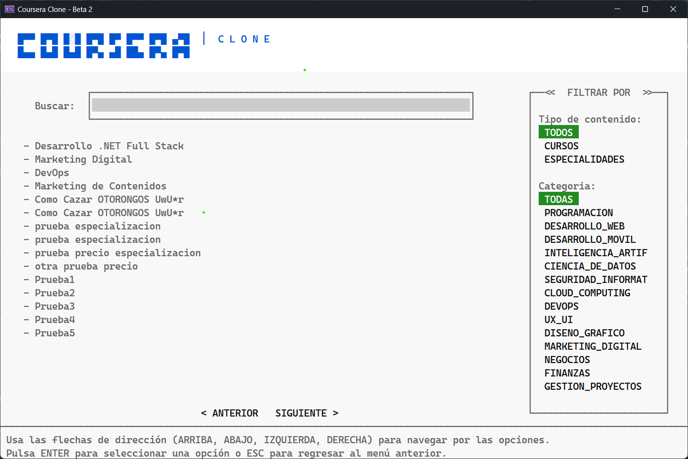
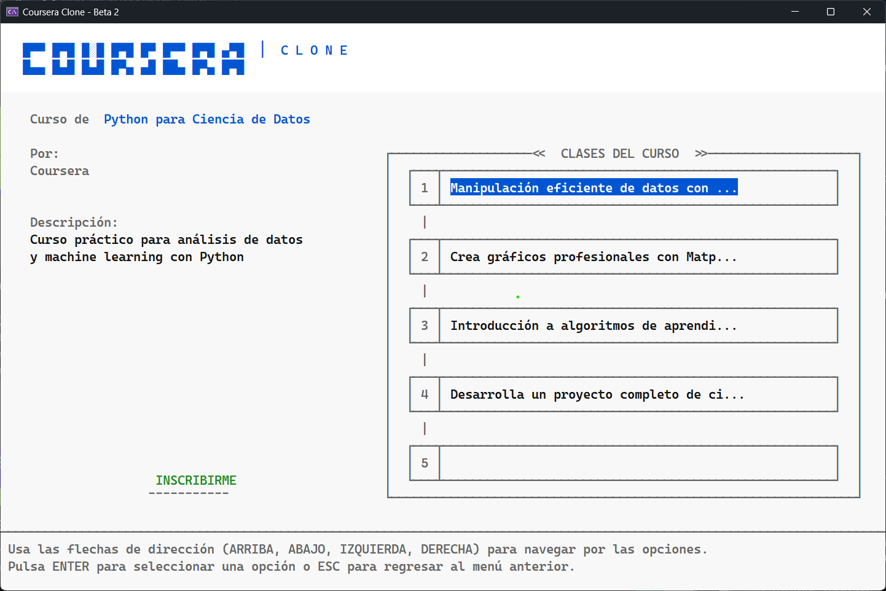
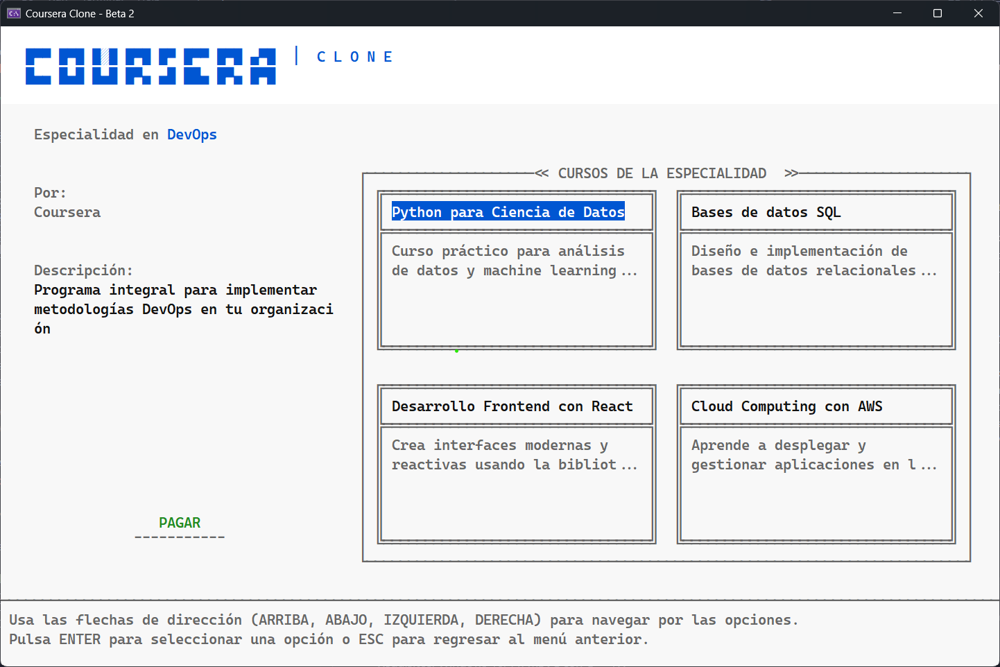
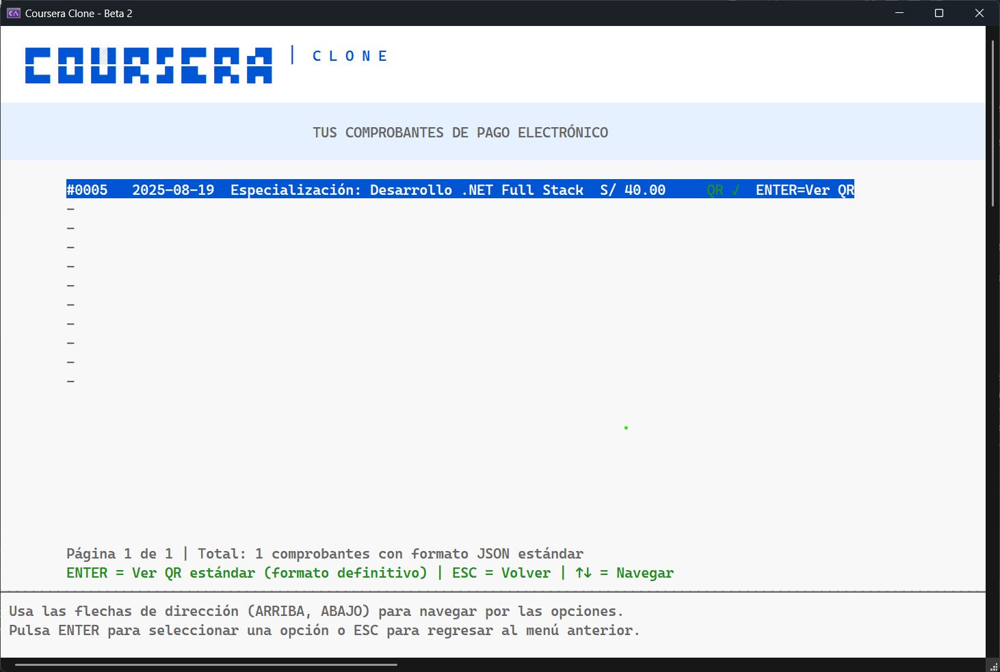
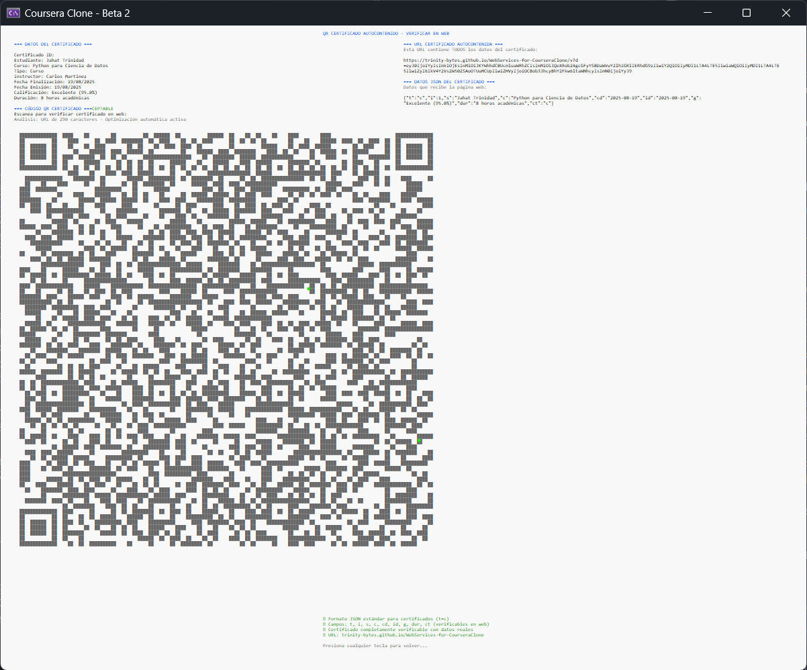
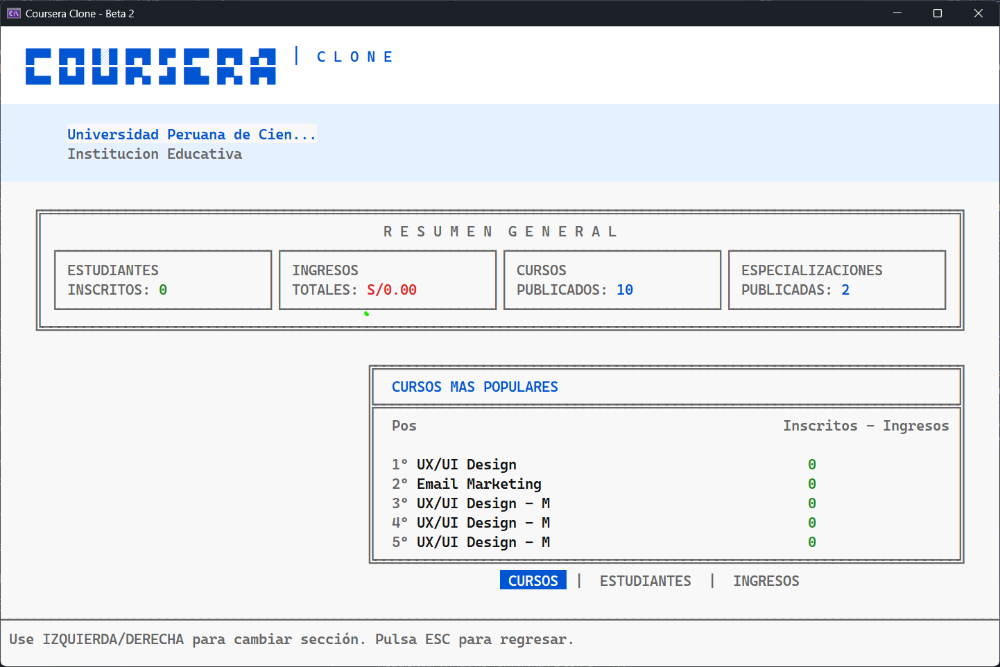

# CourseraClone C++

<div align="center">


</div>

Aplicación de consola en C++ que simula una plataforma educativa: gestión de cursos y especializaciones, inscripciones, pagos y certificados con QR, construida sobre estructuras de datos y algoritmos implementados desde cero.

**Versión:** 2.0.0 (Final)  
**Autores:** [Fabrizio Santi](https://github.com/Santi2007939), [Mauricio Teran](https://github.com/mau-tz), [Jahat Trinidad](https://github.com/trinity-bytes)  
**Curso:** Algoritmos y Estructura de Datos — UPC  
**Finalizado:** Jul 2025

Licencias: Código bajo [Polyform Noncommercial 1.0.0](LICENSE). Documentación e imágenes bajo [CC BY-NC-SA 4.0](LICENSE-docs).

## ⚠️ Disclaimer / Integridad académica

Este repositorio es público con fines educativos y de referencia.

- Se prohíbe el plagio total o parcial y cualquier uso que vulnere el Código de Integridad/Probidad Académica de la UPC o de cualquier otra institución educativa.
- Puedes estudiar el código y reutilizar ideas o fragmentos no evaluados citando la fuente. Todo trabajo evaluable debe ser de autoría propia.
- Los autores no asumen responsabilidad por usos indebidos. Cualquier fork o contribución debe respetar estas condiciones.

Nota legal: este repositorio se publica con licencias de uso no comercial (ver enlaces arriba).

## 🚀 Inicio rápido

1) Clona y abre la solución en Visual Studio 2022.

```powershell
git clone https://github.com/trinity-bytes/CourseraClone.git; cd CourseraClone
start .\CourseraClone.sln
```

2) Asegura en VS: Configuración Debug/Release, Plataforma x64, SDK de Windows instalado.  
3) Compila con Ctrl+Shift+B.  
4) Ejecuta desde Visual Studio (F5) o desde la carpeta de salida:

```powershell
cd .\x64\Debug\
.\CourseraClone.exe
```

Requisitos: Windows 10/11, MSVC con C++17.

## ✨ Funcionalidades clave

- Usuarios: registro/login de estudiantes y organizaciones; perfiles y sesiones.
- Contenido: cursos, clases y especializaciones; búsqueda/filtros y ordenamientos.
- Inscripciones y pagos: ventas, comprobantes y boletas.
- Certificados: generación y verificación con códigos QR.
- Arquitectura modular con controladores y pantallas de consola.

## 🧠 DSA y algoritmos

- Estructuras: AVL, BST, HashTable (chaining), BinaryHeap/PriorityQueue, LinkedList, Queue, Stack, Grafo.
- Algoritmos: búsquedas (binaria/sec), ordenamientos (Quick/Merge/Heap), BFS/DFS, utilidades de validación.

## 📁 Estructura del repo (resumen)

```
Headers/
   Controllers/, DataStructures/, Entities/, Screens/, Types/, Utils/
Resources/
   Data/ (Content/, Core/, Financial/, Index/)
   Documentation/ (guías y especificaciones)
Source/
   CourseraCloneApp.cpp
```

## 🖼️ Galería

1. Landing (contenido popular)

   

2. Login (validaciones)

   

3. Dashboard Estudiante (progreso y recomendaciones)

   

4. Dashboard Organización (métricas)

   

5. Explorar y búsqueda (filtros/ordenamientos)

   

6. Detalle de curso

   

7. Detalle de especialidad (en lugar de inscripción)

   

8. Comprobante/boleta

   

9. Certificado con QR

   

10. Estadísticas y reportes

   

## 🔗 Documentación

- Guía de instalación y uso: [Guia_Instalacion_Uso_Final.md](Resources/Documentation/Guia_Instalacion_Uso_Final.md)
- Entendiendo el proyecto: [Entendiendo el proyecto.md](Resources/Documentation/Entendiendo%20el%20proyecto.md)
- Especificaciones técnicas: [Especificaciones_Tecnicas_Finales.md](Resources/Documentation/Especificaciones_Tecnicas_Finales.md)
- Estilo de código: [Guia de Estilo de Codigo.md](Resources/Documentation/Guia%20de%20Estilo%20de%20Codigo.md)

Documentos QR:

- Implementación: [Implementacion_QR_Certificados.md](Resources/Documentation/Implementacion_QR_Certificados.md)
- Ejemplo práctico: [Ejemplo_Practico_QR.md](Resources/Documentation/Ejemplo_Practico_QR.md)
- Integración con datos: [Integracion_QR_Datos_Reales.md](Resources/Documentation/Integracion_QR_Datos_Reales.md)
- Optimizaciones: [Optimizaciones_QR.md](Resources/Documentation/Optimizaciones_QR.md)

## 🤝 Equipo

<div align="center">

<a href="https://github.com/Santi2007939" title="Fabrizio Santi">
   
</a>
&nbsp;&nbsp;
<a href="https://github.com/mau-tz" title="Mauricio Teran">
   
</a>
&nbsp;&nbsp;
<a href="https://github.com/trinity-bytes" title="Jahat Trinidad">
   
</a>

</div>

- [Fabrizio Santi](https://github.com/Santi2007939) — Ordenamientos, DSA (AVL/Heap/PQ), LinkedList, inscripciones.
- [Mauricio Teran](https://github.com/mau-tz) — Búsquedas, HashTable/BST.
- [Jahat Trinidad](https://github.com/trinity-bytes) — Arquitectura, UI de consola, persistencia, utilidades, QR.

Proyecto académico (UPC) — Uso educativo.

---

<div align="center">

Hecho con ❤️ para el curso de AyED — UPC (Jul 2025)

</div>
