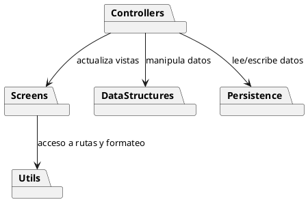
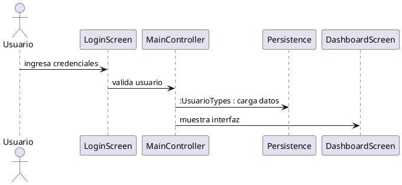
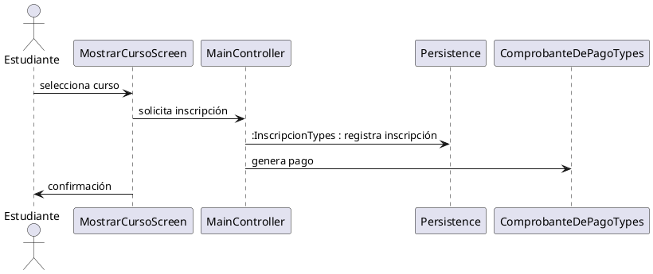
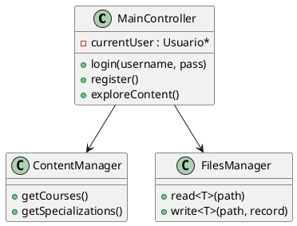

# Entendiendo el Proyecto CourseraClone

**Fecha:** 12 de junio de 2025

---

## 1. Introducción

El presente documento tiene como objetivo ofrecer una visión completa y detallada de la arquitectura y la lógica interna de **CourseraClone**, un sistema de gestión de cursos en línea. Está dirigido principalmente a desarrolladores del proyecto y, de manera secundaria, al cuerpo docente que supervise su desarrollo. A través de esta guía, el lector podrá familiarizarse con la organización de los módulos, las interacciones entre clases y la estructura de datos subyacente sin necesidad de explorar directamente el código fuente.

## 2. Visión General de la Arquitectura

El sistema se organiza en cinco capas principales:

1. **Interfaces de usuario (Screens)**: pantallas de interacción con el usuario.
2. **Controladores (Controllers)**: lógica de negocio y coordinación entre módulos.
3. **Estructuras de datos (DataStructures)**: implementaciones genéricas (listas, árboles, tablas hash, colas, pilas, etc.).
4. **Persistencia (Persistence)**: definición de tipos y gestión de archivos de datos.
5. **Utilidades (Utils)**: rutas, configuración y funciones auxiliares.

## 3. Capas del Sistema

### 3.1 Screens

Ubicadas en `Resources/Screens`, cada clase extiende `ScreenSystem` y define la interfaz textual.

- `LoginScreen.hpp`
- `LandingPageScreen.hpp`
- `ExplorarContenidoScreen.hpp`

### 3.2 Controllers

En `Headers/Controllers`, contienen la lógica de negocio y funcionan como puente:

- **MainController**: punto de entrada y flujo principal.
- **ContentManager**: carga, filtra y presenta cursos y especializaciones.
- **FilesManager**: lectura y escritura genérica de ficheros.

### 3.3 Estructuras de Datos

Implementaciones genéricas en `DataStructures`:

- `LinkedList`, `BinaryHeap`, `HashTable`, `BinarySearchTree`, etc.
- Proveen operaciones estándar (inserción, búsqueda, ordenación).

### 3.4 Persistence Types

Definidos en `Persistence/*.hpp`, modelan el formato en archivos.

- `UsuarioTypes.hpp`
- `InscripcionTypes.hpp`
- `ComprobanteDePagoTypes.hpp`

### 3.5 Utils

Funciones de apoyo en `Utils`:

- `DataPaths.hpp`: rutas absolutas y relativas a ficheros.
- `SystemUtils.hpp`: manejo de errores y logs.
- `UI_Ascii.hpp`: gráficos y arte ASCII.
- `ScreenSystem.hpp`: base para pantallas.

## 4. Flujo de Datos y Secuencias de Ejecución

### 4.1 Inicio de la Aplicación

1. **CourseraCloneApp.cpp** invoca a `MainController`
2. `MainController` despliega `LandingPageScreen`

### 4.2 Autenticación de Usuario

### 4.3 Exploración de Contenido

1. `ExplorarContenidoScreen` solicita lista de cursos
2. `ContentManager` recupera índices y datos
3. `ExplorarContenidoScreen` renderiza resultados

### 4.4 Inscripción y Pago

## 5. Interacción entre Clases

Al generarse una inscripción:

1. `MainController` crea instancia de `Inscripcion` (Entidad).
2. Se utiliza `FilesManager::writeRecord(...)` para persistir en `DB_Inscripciones.dat`.
3. `HashTable` indexa la nueva entrada para búsquedas rápidas.

## 6. Diagramas de Clases Principales

## 7. Conclusión

Este documento provee una descripción exhaustiva de la estructura y funcionamiento de **CourseraClone**. Mediante la comprensión de sus capas, módulos y flujos internos, el equipo de desarrollo podrá mantener, extender y depurar el sistema con mayor eficiencia.
