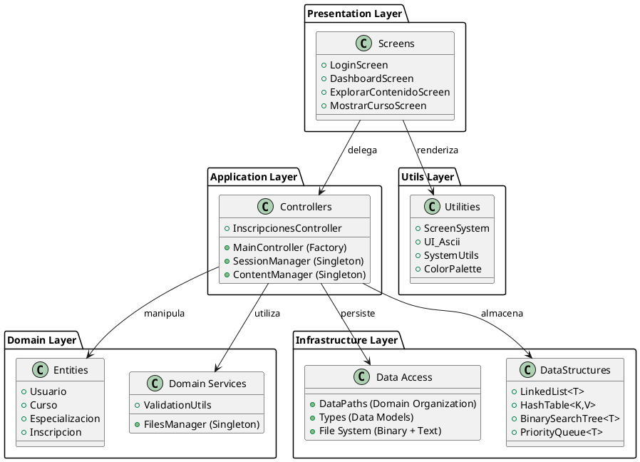
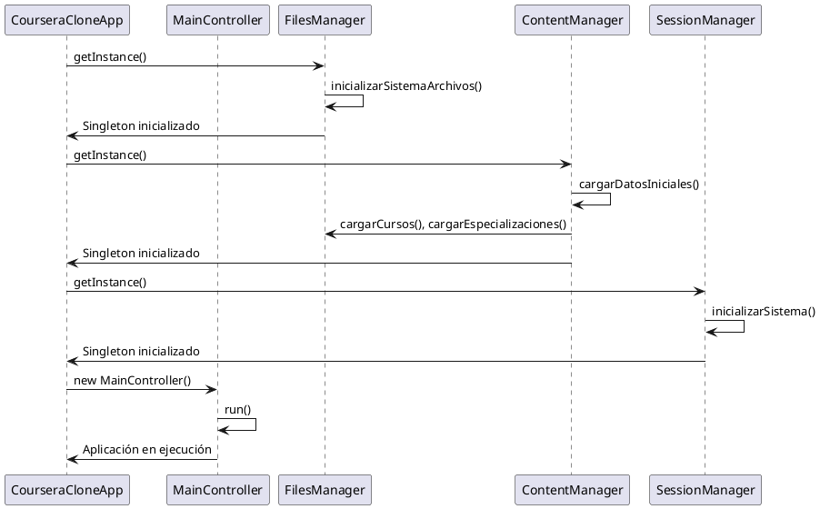
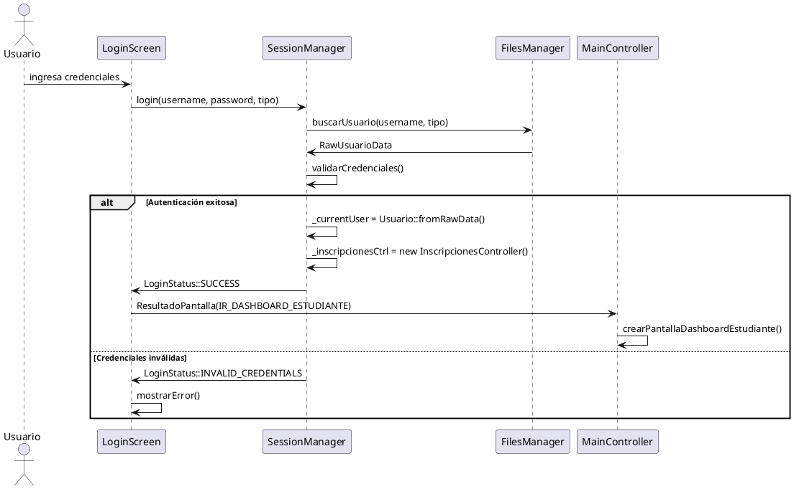
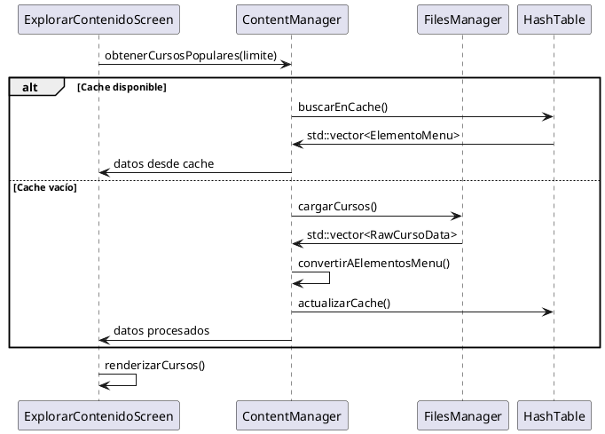
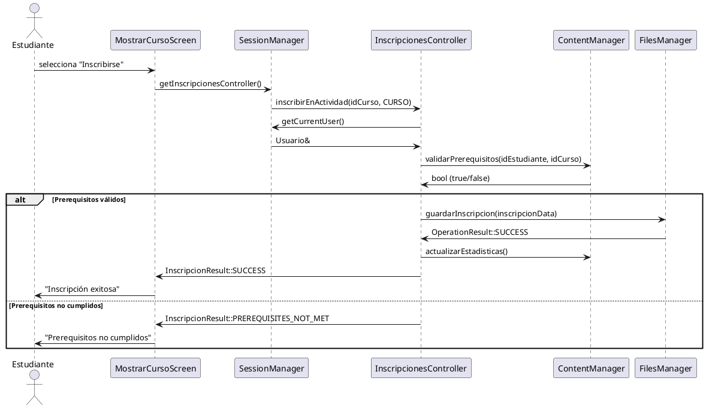
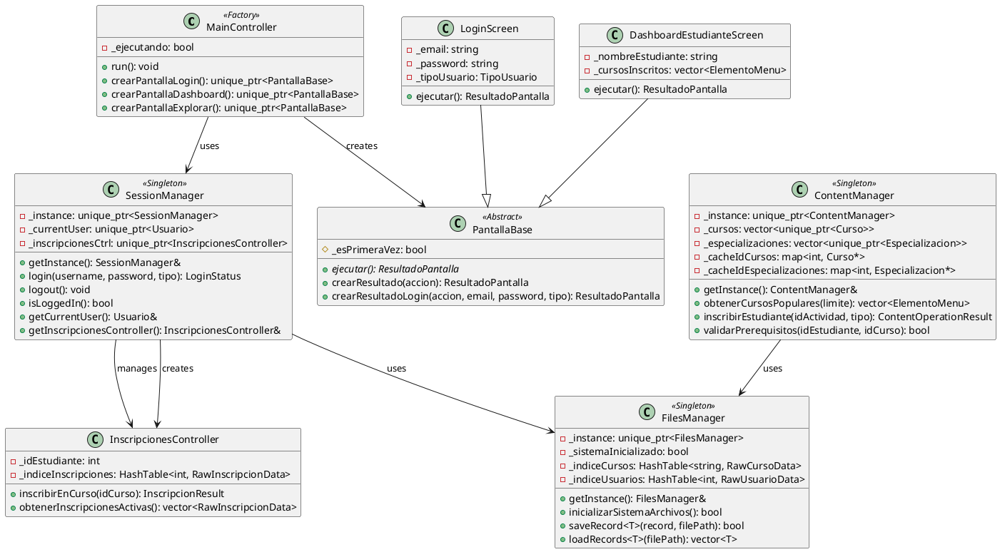
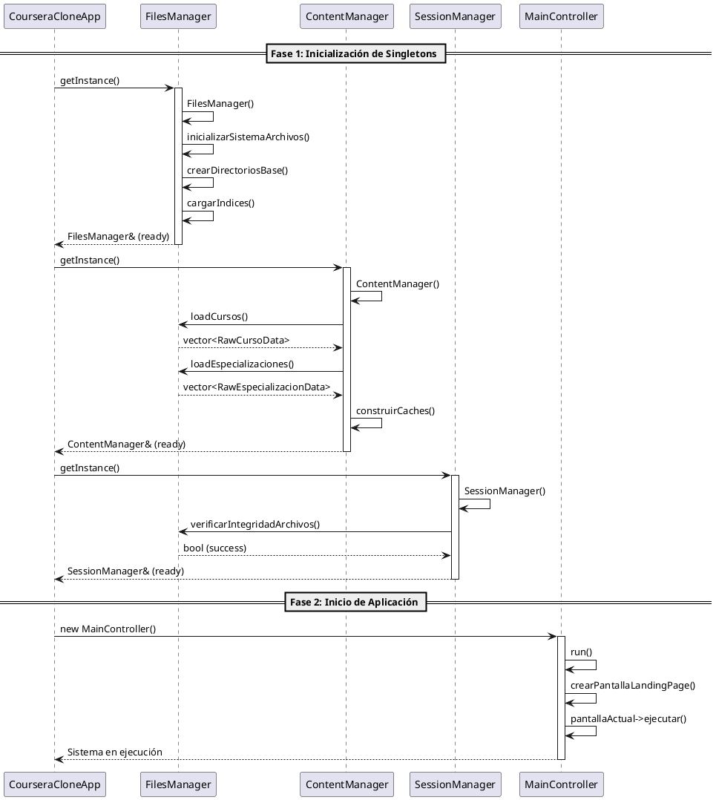
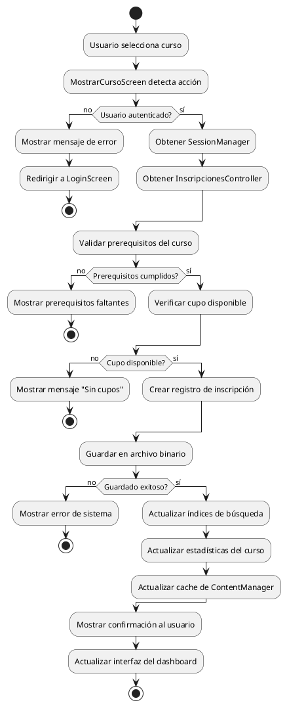
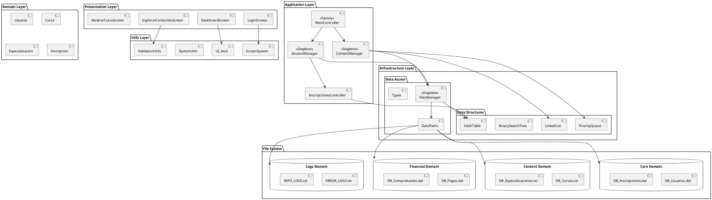

# Entendiendo el Proyecto CourseraClone

**Autores:** Equipo Desarrollador de CourseraClone  
**Última actualización:** 27 de junio de 2025

---

## 1. Introducción

El presente documento ofrece una visión completa y detallada de la arquitectura y lógica interna de **CourseraClone**, un sistema avanzado de gestión de cursos en línea implementado en C++ con arquitectura header-only. Está dirigido principalmente a desarrolladores del proyecto y al cuerpo docente que supervise su desarrollo.

A través de esta guía, el lector podrá familiarizarse con la organización modular del sistema, los patrones de diseño implementados, las interacciones entre componentes y la estructura de datos subyacente, todo sin necesidad de explorar directamente el código fuente.

### Características Principales del Sistema

- **Arquitectura Header-Only**: Optimizada para compilación single-file con múltiples headers
- **Patrones de Diseño Avanzados**: Singleton, Factory, Screen System, Domain-Driven Design
- **Gestión por Dominios**: Organización de datos por áreas de negocio
- **Estructuras de Datos Especializadas**: Implementaciones propias de BST, HashMap, PriorityQueue
- **Sistema de Sesiones Robusto**: Gestión centralizada de autenticación y estado

## 2. Arquitectura del Sistema: Domain-Driven Design

### 2.1 Principios Arquitectónicos

Nuestro sistema ha evolucionado hacia una **arquitectura por dominios** que separa claramente las responsabilidades:

1. **Domain-Driven Design (DDD)**: Organización por áreas de negocio
2. **Header-Only Architecture**: Optimización para compilación y distribución
3. **Singleton Pattern**: Gestión centralizada de recursos críticos
4. **Factory Pattern**: Creación dinámica de componentes
5. **Clean Architecture**: Separación de capas por responsabilidad

### 2.2 Estructura de Capas Modernizada



### 2.3 Organización por Dominios de Negocio

```
Headers/
├── Controllers/           # Application Layer - Coordinación
│   ├── MainController     # Factory de pantallas + navegación
│   ├── SessionManager     # Singleton - Gestión de sesiones
│   ├── ContentManager     # Singleton - Gestión de contenido
│   ├── FilesManager       # Singleton - Persistencia
│   └── InscripcionesController # Lógica de inscripciones
├── Entities/              # Domain Layer - Entidades de negocio
│   ├── Usuario, Estudiante, Empresa
│   ├── Curso, Especializacion, Clase
│   └── Inscripcion, ComprobanteDePago
├── Screens/               # Presentation Layer - Interfaces
│   ├── Login/Registro, Dashboards
│   ├── Mostrar Curso/Especialización
│   └── Explorar Contenido, Perfiles
├── DataStructures/        # Infrastructure - Estructuras genéricas
│   ├── LinkedList, HashTable, BST
│   ├── PriorityQueue, BinaryHeap
│   └── Algoritmos de búsqueda/ordenamiento
├── Types/                 # Infrastructure - Modelos de datos
│   ├── UsuarioTypes, InscripcionTypes
│   └── ComprobanteDePagoTypes, FilesTypes
└── Utils/                 # Cross-cutting - Utilidades
    ├── ScreenSystem, UI_Ascii
    ├── DataPaths (organización por dominios)
    └── SystemUtils, ValidationUtils
```

### 2.4 Dominios de Datos Organizados

```
Resources/Data/
├── Core/                  # Dominio Núcleo
│   ├── DB_Usuarios.dat       # Datos binarios de usuarios
│   ├── DB_Inscripciones.dat  # Registro de inscripciones
│   └── Index/                # Índices para búsquedas rápidas
├── Content/               # Dominio de Contenido
│   ├── DB_Cursos.txt         # Catálogo de cursos
│   └── DB_Especializaciones.txt # Especializaciones disponibles
├── Financial/             # Dominio Financiero
│   ├── DB_Pagos.dat          # Transacciones y pagos
│   └── DB_Comprobantes.dat   # Comprobantes generados
└── Logs/                  # Dominio de Auditoría
    ├── ERROR_LOGS.txt        # Registro de errores
    └── INFO_LOGS.txt         # Logs informativos
```

## 3. Componentes del Sistema por Capas

### 3.1 Presentation Layer - Screens

Sistema unificado de pantallas basado en `PantallaBase` (clase abstracta):

#### Pantallas Principales Implementadas:

- **`LoginScreen.hpp`** - Autenticación con validación de tipos de usuario
- **`RegistroScreen.hpp`** - Registro de nuevos usuarios
- **`LandingPageScreen.hpp`** - Página principal con contenido dinámico
- **`DashboardEstudianteScreen.hpp`** - Panel principal del estudiante
- **`DashboardOrganizacionScreen.hpp`** - Panel de gestión organizacional
- **`ExplorarContenidoScreen.hpp`** - Exploración y búsqueda de cursos
- **`MostrarCursoScreen.hpp`** - Detalles y inscripción a cursos
- **`MostrarEspecialidadScreen.hpp`** - Información de especializaciones
- **`PerfilEstudianteScreen.hpp`** - Gestión de perfil de estudiante
- **`PerfilOrganizacionScreen.hpp`** - Gestión de perfil organizacional

#### Características del Sistema de Pantallas:

- **Estado persistente**: Cada pantalla mantiene su estado entre navegaciones
- **Navegación tipada**: Sistema `ResultadoPantalla` para control de flujo
- **Renderizado eficiente**: Solo actualiza elementos que cambiaron
- **Validación integrada**: Manejo de errores y entrada de usuario

### 3.2 Application Layer - Controllers

#### **MainController** (Factory Pattern)

```cpp
class MainController {
    // Factory methods para creación dinámica de pantallas
    std::unique_ptr<PantallaBase> crearPantallaLogin();
    std::unique_ptr<PantallaBase> crearPantallaDashboardEstudiante();
    // ... otros factory methods

    void run(); // Loop principal de navegación
};
```

#### **SessionManager** (Singleton Pattern)

```cpp
class SessionManager {
    static SessionManager& getInstance();

    LoginStatus login(const std::string& username, const std::string& password, TipoUsuario tipo);
    void logout();
    bool isLoggedIn();
    Usuario& getCurrentUser();
    InscripcionesController& getInscripcionesController();
};
```

#### **ContentManager** (Singleton Pattern)

```cpp
class ContentManager {
    static ContentManager& getInstance();

    // Gestión de contenido
    std::vector<ElementoMenu> obtenerCursosPopulares(int limite);
    std::vector<ElementoMenu> obtenerEspecializacionesPopulares(int limite);

    // Operaciones CRUD
    ContentOperationResult inscribirEstudiante(int idActividad, TipoActividad tipo);
    bool validarPrerequisitos(int idEstudiante, int idCurso);

    // Cachés para optimización
    std::map<int, Curso*> _cacheIdCursos;
    std::map<int, Especializacion*> _cacheIdEspecializaciones;
};
```

#### **FilesManager** (Singleton Pattern)

```cpp
class FilesManager {
    static FilesManager& getInstance();

    // Operaciones de archivo genéricas
    template<typename T> bool saveRecord(const T& record, const std::string& filePath);
    template<typename T> std::vector<T> loadRecords(const std::string& filePath);

    // Inicialización del sistema
    bool inicializarSistemaArchivos();

    // Logging centralizado
    void logError(const std::string& operation, const std::string& error);
    void logInfo(const std::string& operation, const std::string& details);
};
```

### 3.3 Domain Layer - Entities

Entidades de negocio principales con arquitectura header-only:

#### **Usuario** (Clase base)

```cpp
class Usuario {
protected:
    int _id;
    TipoUsuario _tipoUsuario;
    std::string _nombreCompleto;
    std::string _username;
    std::string _contrasenaHash;
    std::string _fechaRegistro;

public:
    // Métodos de autenticación
    static LoginStatus autenticar(const std::string& username, const std::string& password, TipoUsuario tipo);

    // Conversión a/desde formato binario
    RawUsuarioData toRawData() const;
    static std::unique_ptr<Usuario> fromRawData(const RawUsuarioData& data);
};
```

#### **Curso y Especializacion**

```cpp
class Curso {
private:
    int _id;
    std::string _titulo;
    std::string _descripcion;
    std::string _organizacion;
    LinkedList<Actividad> _actividades;

public:
    bool agregarActividad(const Actividad& actividad);
    bool validarPrerequisitos(const std::vector<int>& cursosCompletados);
    double calcularCalificacionPromedio();
};
```

### 3.4 Infrastructure Layer - Data Access

#### **Organización por Dominios (DataPaths)**

```cpp
class DataPaths {
    // Dominio Núcleo
    struct Core {
        static const std::string DB_USUARIOS;
        static const std::string DB_INSCRIPCIONES;
        static const std::string INDICES_ESTUDIANTES;
    };

    // Dominio de Contenido
    struct Content {
        static const std::string DB_CURSOS;
        static const std::string DB_ESPECIALIZACIONES;
    };

    // Dominio Financiero
    struct Financial {
        static const std::string DB_PAGOS;
        static const std::string DB_COMPROBANTES;
    };
};
```

#### **Types** (Modelos de Datos)

- **`UsuarioTypes.hpp`** - Estructuras para datos de usuario y autenticación
- **`InscripcionTypes.hpp`** - Modelos de inscripciones y progreso
- **`ComprobanteDePagoTypes.hpp`** - Estructuras financieras
- **`ActividadTypes.hpp`** - Tipos para cursos y especializaciones
- **`FilesTypes.hpp`** - Enums y estructuras de archivos

### 3.5 Infrastructure Layer - DataStructures

Implementaciones genéricas optimizadas para el sistema:

#### **Estructuras Principales**

```cpp
template<typename T>
class LinkedList {
    void push_back(const T& elemento);
    T& operator[](size_t index);
    size_t size() const;
    // Iteradores para range-based for loops
};

template<typename K, typename V>
class HashTable {
    void insert(const K& key, const V& value);
    V* find(const K& key);
    bool remove(const K& key);
    // Manejo de colisiones con chaining
};

template<typename T>
class BinarySearchTree {
    void insert(const T& value);
    bool search(const T& value);
    void inorder(std::function<void(const T&)> callback);
    // Balanceado automático opcional
};
```

#### **Algoritmos Especializados**

- **`algoritmosBusqueda.hpp`** - Búsqueda binaria, linear, hash-based
- **`algoritmosOrdenamiento.hpp`** - QuickSort, MergeSort, HeapSort
- **Optimizaciones específicas** para tipos de datos del dominio

### 3.6 Utils Layer - Cross-cutting Concerns

#### **ScreenSystem** (Sistema Base de Pantallas)

```cpp
class PantallaBase {
protected:
    bool _esPrimeraVez = true;

    // Helpers para resultados tipados
    ResultadoPantalla crearResultado(AccionPantalla accion);
    ResultadoPantalla crearResultadoLogin(AccionPantalla accion, const std::string& email,
                                          const std::string& password, TipoUsuario tipo);

public:
    virtual ResultadoPantalla ejecutar() = 0;
    virtual ~PantallaBase() = default;
};
```

#### **UI y Utilidades**

- **`UI_Ascii.hpp`** - Arte ASCII y elementos de interfaz (300+ líneas de UI)
- **`ColorPalette.hpp`** - Sistema de colores consistente
- **`SystemUtils.hpp`** - Utilidades del sistema y configuración
- **`ValidationUtils.hpp`** - Validaciones de entrada y datos
- **`InputUtils.hpp`** - Manejo de entrada de teclado especializada

## 4. Patrones de Diseño y Flujos de Ejecución

### 4.1 Patrones de Diseño Implementados

#### **4.1.1 Singleton Pattern - Gestión de Recursos Críticos**

Nuestro sistema utiliza el patrón Singleton para garantizar una única instancia de controladores críticos:

```cpp
// Implementación Thread-Safe con std::call_once
class SessionManager {
private:
    static std::unique_ptr<SessionManager> _instance;
    static std::once_flag _onceFlag;

    SessionManager(); // Constructor privado

public:
    static SessionManager& getInstance() {
        std::call_once(_onceFlag, []() {
            _instance.reset(new SessionManager());
        });
        return *_instance;
    }

    // Eliminar copia y asignación
    SessionManager(const SessionManager&) = delete;
    SessionManager& operator=(const SessionManager&) = delete;
};
```

**Singletons Implementados:**

- **`SessionManager`** - Gestión centralizada de sesiones de usuario
- **`ContentManager`** - Cache y gestión de contenido del sistema
- **`FilesManager`** - Operaciones de archivo y persistencia

#### **4.1.2 Factory Pattern - Creación Dinámica de Pantallas**

El `MainController` implementa el patrón Factory para crear pantallas dinámicamente:

```cpp
class MainController {
private:
    // Factory methods específicos por tipo de pantalla
    inline std::unique_ptr<PantallaBase> crearPantallaLogin();
    inline std::unique_ptr<PantallaBase> crearPantallaDashboardEstudiante();
    inline std::unique_ptr<PantallaBase> crearPantallaExplorarContenido();
    // ... otros factory methods

public:
    void run() {
        std::unique_ptr<PantallaBase> pantallaActual = crearPantallaLandingPage();

        while (_ejecutando) {
            ResultadoPantalla resultado = pantallaActual->ejecutar();

            // Factory dinámico basado en el resultado
            switch (resultado.accion) {
                case AccionPantalla::IR_LOGIN:
                    pantallaActual = crearPantallaLogin();
                    break;
                case AccionPantalla::IR_DASHBOARD_ESTUDIANTE:
                    pantallaActual = crearPantallaDashboardEstudiante();
                    break;
                // ... otros casos
            }
        }
    }
};
```

#### **4.1.3 Screen System Pattern - Navegación Tipada**

Sistema especializado de pantallas con navegación tipada y estado persistente:

```cpp
// Estructura de resultado tipada
struct ResultadoPantalla {
    AccionPantalla accion;
    TipoUsuario tipoUsuario;
    std::string email, password;
    int idCursoSeleccionado;
    int idEspecializacionSeleccionada;

    ResultadoPantalla(AccionPantalla _accion) : accion(_accion) {}
    // ... otros constructores especializados
};

// Clase base abstracta con helpers
class PantallaBase {
protected:
    bool _esPrimeraVez = true;

    // Helpers para crear resultados tipados
    inline ResultadoPantalla crearResultado(AccionPantalla accion);
    inline ResultadoPantalla crearResultadoLogin(AccionPantalla accion,
                                                 const std::string& email,
                                                 const std::string& password,
                                                 TipoUsuario tipo);

public:
    virtual ResultadoPantalla ejecutar() = 0;
    virtual ~PantallaBase() = default;
};
```

#### **4.1.4 Domain-Driven Design - Organización por Dominios**

Separación clara de responsabilidades por áreas de negocio:

```cpp
// Organización de rutas por dominios
class DataPaths {
    struct Core {        // Dominio de usuarios y autenticación
        static const std::string DB_USUARIOS;
        static const std::string DB_INSCRIPCIONES;
    };

    struct Content {     // Dominio de contenido académico
        static const std::string DB_CURSOS;
        static const std::string DB_ESPECIALIZACIONES;
    };

    struct Financial {   // Dominio financiero y pagos
        static const std::string DB_PAGOS;
        static const std::string DB_COMPROBANTES;
    };

    struct Logs {        // Dominio de auditoría
        static const std::string ERROR_LOGS;
        static const std::string INFO_LOGS;
    };
};
```

### 4.2 Secuencias de Ejecución Modernas

#### **4.2.1 Inicialización del Sistema**



#### **4.2.2 Autenticación con SessionManager**



#### **4.2.3 Gestión de Contenido con Cache**



#### **4.2.4 Inscripción con Múltiples Controladores**



### 4.3 Optimizaciones de Arquitectura Header-Only

#### **4.3.1 Gestión de Memoria y ODR Compliance**

```cpp
// Definiciones inline para evitar ODR violations
class ContentManager {
private:
    static std::unique_ptr<ContentManager> _instance;
    static std::once_flag _onceFlag;

public:
    // Métodos inline para optimización
    inline std::vector<ElementoMenu> obtenerActividadesPopulares(TipoActividad tipo, int limite);
    inline bool validarPrerequisitos(int idEstudiante, int idCurso);
};

// Definiciones de miembros estáticos (inline para header-only)
inline std::unique_ptr<ContentManager> ContentManager::_instance = nullptr;
inline std::once_flag ContentManager::_onceFlag;
```

#### **4.3.2 Template Specialization para Tipos de Dominio**

```cpp
// Especialización de HashTable para tipos específicos del dominio
template<>
class HashTable<std::string, RawCursoData> {
    // Función hash optimizada para títulos de cursos
    inline size_t hash(const std::string& titulo) const {
        // Hash específico para títulos en español
        return hashEspanol(titulo) % _capacity;
    }

    // Comparación optimizada para cursos
    inline bool isEqual(const std::string& titulo1, const std::string& titulo2) const {
        return normalizarTitulo(titulo1) == normalizarTitulo(titulo2);
    }
};
```

### 4.4 Beneficios de los Patrones Implementados

1. **Singleton Pattern**:

   - Garantiza una única fuente de verdad para estado crítico
   - Thread-safety con `std::call_once`
   - Gestión automática de memoria con `std::unique_ptr`

2. **Factory Pattern**:

   - Creación dinámica de pantallas sin acoplamiento
   - Extensibilidad para nuevas pantallas
   - Control centralizado del flujo de navegación

3. **Screen System Pattern**:

   - Navegación tipada y segura
   - Estado persistente entre transiciones
   - Separación clara de responsabilidades UI

4. **Domain-Driven Design**:
   - Organización clara por áreas de negocio
   - Escalabilidad y mantenibilidad
   - Separación de concerns

## 5. Interacciones entre Componentes y Casos de Uso

### 5.1 Casos de Uso Principales

#### **5.1.1 Gestión de Sesiones de Usuario**

El sistema centraliza toda la gestión de sesiones a través del `SessionManager`:

```cpp
// Flujo completo de autenticación
class SessionManager {
    LoginStatus login(const std::string& username, const std::string& password, TipoUsuario tipo) {
        // 1. Buscar usuario en archivos binarios
        FilesManager& files = FilesManager::getInstance();
        auto usuarios = files.loadUsuarios(tipo);

        // 2. Validar credenciales con hash
        for (const auto& userData : usuarios) {
            if (userData.username == username && validarHash(password, userData.passwordHash)) {
                // 3. Crear sesión activa
                _currentUser = Usuario::fromRawData(userData);
                _inscripcionesCtrl = std::make_unique<InscripcionesController>(_currentUser->getId());

                logOperation("Login exitoso", username);
                return LoginStatus::SUCCESS;
            }
        }

        logError("Login fallido", "Credenciales inválidas para: " + username);
        return LoginStatus::INVALID_CREDENTIALS;
    }
};
```

#### **5.1.2 Exploración y Búsqueda de Contenido**

Integración entre `ContentManager` y estructuras de datos para búsquedas eficientes:

```cpp
class ContentManager {
    std::vector<ElementoMenu> buscarCursosPorTitulo(const std::string& query) {
        // 1. Búsqueda en cache con HashTable
        auto resultadosCache = _cacheIdCursos.find(hashearConsulta(query));

        if (resultadosCache != _cacheIdCursos.end()) {
            return convertirDesdeCacheCursos(resultadosCache->second);
        }

        // 2. Búsqueda en archivo con algoritmos optimizados
        auto cursos = FilesManager::getInstance().loadCursos();
        std::vector<RawCursoData> filtrados;

        // Usar algoritmo de búsqueda específico
        algoritmosBusqueda::busquedaPorSubcadena(cursos, query, filtrados,
            [](const RawCursoData& curso) { return curso.titulo; });

        // 3. Actualizar cache para futuras búsquedas
        auto elementos = convertirAElementosMenu(filtrados);
        actualizarCacheBusqueda(query, elementos);

        return elementos;
    }
};
```

#### **5.1.3 Proceso de Inscripción Completo**

Coordinación entre múltiples controladores para inscripciones:

```cpp
class InscripcionesController {
    InscripcionResult inscribirEnCurso(int idCurso) {
        // 1. Validar sesión activa
        if (!SessionManager::getInstance().isLoggedIn()) {
            return InscripcionResult::USER_NOT_LOGGED_IN;
        }

        // 2. Obtener datos del estudiante
        Usuario& estudiante = SessionManager::getInstance().getCurrentUser();

        // 3. Validar prerequisitos con ContentManager
        ContentManager& content = ContentManager::getInstance();
        if (!content.validarPrerequisitos(estudiante.getId(), idCurso)) {
            return InscripcionResult::PREREQUISITES_NOT_MET;
        }

        // 4. Verificar cupo disponible
        if (!content.verificarCupoDisponible(idCurso)) {
            return InscripcionResult::NO_CAPACITY;
        }

        // 5. Crear registro de inscripción
        RawInscripcionData inscripcion;
        inscripcion.idEstudiante = estudiante.getId();
        inscripcion.idActividad = idCurso;
        inscripcion.tipoActividad = TipoActividad::CURSO;
        inscripcion.fechaInscripcion = DateTime::now().toString();
        inscripcion.estado = EstadoInscripcion::ACTIVA;

        // 6. Persistir en archivo binario
        FilesManager& files = FilesManager::getInstance();
        if (!files.saveInscripcion(inscripcion)) {
            return InscripcionResult::FILE_ERROR;
        }

        // 7. Actualizar índices para búsquedas rápidas
        _indiceInscripciones.insert(estudiante.getId(), inscripcion);

        // 8. Actualizar estadísticas del curso
        content.incrementarInscripciones(idCurso);

        logOperation("Inscripción exitosa",
                    "Estudiante: " + std::to_string(estudiante.getId()) +
                    ", Curso: " + std::to_string(idCurso));

        return InscripcionResult::SUCCESS;
    }
};
```

### 5.2 Gestión de Estado y Persistencia

#### **5.2.1 Arquitectura de Archivos por Dominios**

```cpp
// Organización especializada de datos
class DataPaths {
    static std::string getPathForDomain(const std::string& domain, const std::string& file) {
        return BASE_PATH + domain + "/" + file;
    }

public:
    // Rutas organizadas por dominio de negocio
    struct Core {
        static const std::string DB_USUARIOS;     // "Resources/Data/Core/DB_Usuarios.dat"
        static const std::string DB_INSCRIPCIONES; // "Resources/Data/Core/DB_Inscripciones.dat"
    };

    struct Content {
        static const std::string DB_CURSOS;       // "Resources/Data/Content/DB_Cursos.txt"
        static const std::string DB_ESPECIALIZACIONES; // "Resources/Data/Content/DB_Especializaciones.txt"
    };

    struct Financial {
        static const std::string DB_PAGOS;        // "Resources/Data/Financial/DB_Pagos.dat"
        static const std::string DB_COMPROBANTES; // "Resources/Data/Financial/DB_Comprobantes.dat"
    };
};
```

#### **5.2.2 Sistema de Cachés Multinivel**

```cpp
class ContentManager {
private:
    // Cache L1: Acceso directo por ID
    std::map<int, Curso*> _cacheIdCursos;
    std::map<int, Especializacion*> _cacheIdEspecializaciones;

    // Cache L2: Búsquedas frecuentes
    std::map<std::string, std::vector<ElementoMenu>> _cacheBusquedas;

    // Cache L3: Estadísticas y rankings
    std::vector<ElementoMenu> _cursosPopulares;
    std::vector<ElementoMenu> _especializacionesPopulares;

    void actualizarCaches() {
        // Invalidar cachés cuando hay cambios en datos
        _cacheBusquedas.clear();
        recalcularRankings();
        logOperation("Cache actualizado", "Todos los niveles invalidados");
    }

    void recalcularRankings() {
        // Usar PriorityQueue para ordenar por popularidad
        PriorityQueue<RankingItem> ranking;

        for (const auto& curso : _cursos) {
            int inscripciones = contarInscripciones(curso->getId());
            ranking.push(RankingItem{curso->getId(), inscripciones, curso->getTitulo()});
        }

        // Extraer top elementos para cache
        _cursosPopulares.clear();
        while (!ranking.empty() && _cursosPopulares.size() < 10) {
            auto item = ranking.top();
            ranking.pop();
            _cursosPopulares.push_back(ElementoMenu{item.titulo, "", item.id});
        }
    }
};
```

### 5.3 Optimizaciones de Rendimiento

#### **5.3.1 Búsquedas con Estructuras de Datos Especializadas**

```cpp
// Uso de HashTable para búsquedas O(1)
class FilesManager {
private:
    HashTable<std::string, RawCursoData> _indiceCursos;      // Por título
    HashTable<int, RawUsuarioData> _indiceUsuarios;         // Por ID
    HashTable<int, std::vector<RawInscripcionData>> _indiceInscripciones; // Por estudiante

public:
    RawCursoData* buscarCursoPorTitulo(const std::string& titulo) {
        // Búsqueda O(1) en lugar de O(n) lineal
        return _indiceCursos.find(titulo);
    }

    std::vector<RawInscripcionData> obtenerInscripcionesEstudiante(int idEstudiante) {
        // Acceso directo a inscripciones del estudiante
        auto* inscripciones = _indiceInscripciones.find(idEstudiante);
        return inscripciones ? *inscripciones : std::vector<RawInscripcionData>{};
    }
};
```

#### **5.3.2 Lazy Loading y Inicialización Diferida**

```cpp
class ContentManager {
    bool _datosInicializados = false;

    void asegurarDatosInicializados() {
        if (!_datosInicializados) {
            cargarDatosIniciales();
            _datosInicializados = true;
        }
    }

public:
    std::vector<ElementoMenu> obtenerCursosPopulares(int limite) {
        asegurarDatosInicializados(); // Lazy loading

        if (_cursosPopulares.empty()) {
            recalcularRankings(); // Cálculo diferido
        }

        return std::vector<ElementoMenu>(_cursosPopulares.begin(),
                                        _cursosPopulares.begin() +
                                        std::min(limite, static_cast<int>(_cursosPopulares.size())));
    }
};
```

## 6. Diagramas de Arquitectura Actualizados

### 6.1 Diagrama de Clases Principales con Patrones



### 6.2 Diagrama de Secuencia: Inicialización del Sistema



### 6.3 Diagrama de Flujo: Proceso de Inscripción



### 6.4 Diagrama de Componentes: Arquitectura por Dominios



## 7. Extensibilidad y Mantenimiento del Sistema

### 7.1 Guías para Agregar Nuevas Funcionalidades

#### **7.1.1 Agregar una Nueva Pantalla**

```cpp
// 1. Crear la nueva pantalla heredando de PantallaBase
class NuevaPantallaScreen : public PantallaBase {
private:
    // Estado específico de la pantalla
    int _opcionActual = 0;
    bool _datosInicializados = false;

public:
    ResultadoPantalla ejecutar() override {
        if (_esPrimeraVez) {
            inicializarDatos();
            marcarComoVisitada();
        }

        // Lógica de renderizado y navegación
        return crearResultado(AccionPantalla::IR_MENU_PRINCIPAL);
    }

private:
    void inicializarDatos() {
        // Cargar datos específicos
    }
};

// 2. Agregar factory method en MainController
class MainController {
    inline std::unique_ptr<PantallaBase> crearNuevaPantalla() {
        return std::make_unique<NuevaPantallaScreen>();
    }

    // 3. Agregar caso en el switch de navegación
    void run() {
        // ...
        switch (resultado.accion) {
            case AccionPantalla::IR_NUEVA_PANTALLA:
                pantallaActual = crearNuevaPantalla();
                break;
            // ...
        }
    }
};

// 4. Agregar nueva acción en ScreenTypes.hpp
enum class AccionPantalla {
    // ...existing actions...
    IR_NUEVA_PANTALLA,
    // ...
};
```

#### **7.1.2 Agregar un Nuevo Dominio de Datos**

```cpp
// 1. Extender DataPaths con el nuevo dominio
class DataPaths {
    // ...existing domains...

    struct Reports {  // Nuevo dominio
        static const std::string BASE;
        static const std::string DB_ANALYTICS;
        static const std::string DB_REPORTES_ESTUDIANTES;
        static const std::string INDICES_REPORTES;
    };
};

// 2. Definir las rutas en DataPaths.cpp (si existe) o inline
inline const std::string DataPaths::Reports::BASE = "Resources/Data/Reports/";
inline const std::string DataPaths::Reports::DB_ANALYTICS = BASE + "DB_Analytics.dat";

// 3. Crear tipos específicos del dominio
// En Headers/Types/ReportsTypes.hpp
struct RawAnalyticsData {
    int idReporte;
    int idEstudiante;
    char fechaGeneracion[20];
    double tiempoEstudio;
    int cursosCompletados;
    // ... otros campos
};

// 4. Extender FilesManager con métodos del nuevo dominio
class FilesManager {
public:
    std::vector<RawAnalyticsData> loadAnalytics() {
        return loadRecords<RawAnalyticsData>(DataPaths::Reports::DB_ANALYTICS);
    }

    bool saveAnalytics(const RawAnalyticsData& data) {
        return saveRecord(data, DataPaths::Reports::DB_ANALYTICS);
    }
};
```

#### **7.1.3 Agregar una Nueva Estructura de Datos**

```cpp
// 1. Crear en Headers/DataStructures/NuevaEstructura.hpp
template<typename T>
class Graph {
private:
    struct Node {
        T data;
        LinkedList<Node*> adjacents;
    };

    LinkedList<Node> _nodes;
    HashTable<T, Node*> _nodeIndex;

public:
    void addNode(const T& data) {
        Node newNode;
        newNode.data = data;
        _nodes.push_back(newNode);
        _nodeIndex.insert(data, &_nodes.back());
    }

    void addEdge(const T& from, const T& to) {
        Node* fromNode = _nodeIndex.find(from);
        Node* toNode = _nodeIndex.find(to);

        if (fromNode && toNode) {
            fromNode->adjacents.push_back(toNode);
        }
    }

    // Algoritmos específicos
    bool hasPath(const T& from, const T& to);
    LinkedList<T> shortestPath(const T& from, const T& to);
};

// 2. Usar en un controlador específico
class CoursePrerequisitesManager {
private:
    Graph<int> _prerequisiteGraph;  // Grafo de prerequisitos por ID de curso

public:
    void buildPrerequisiteGraph() {
        // Construir grafo basado en datos de cursos
        auto cursos = ContentManager::getInstance().getAllCursos();

        for (const auto& curso : cursos) {
            _prerequisiteGraph.addNode(curso.getId());

            for (int prerequisitoId : curso.getPrerequisitos()) {
                _prerequisiteGraph.addEdge(prerequisitoId, curso.getId());
            }
        }
    }

    bool validarRutaAprendizaje(int idEstudiante, int idCursoObjetivo) {
        auto cursosCompletados = obtenerCursosCompletados(idEstudiante);

        for (int cursoCompletado : cursosCompletados) {
            if (_prerequisiteGraph.hasPath(cursoCompletado, idCursoObjetivo)) {
                return true;
            }
        }

        return false;
    }
};
```

### 7.2 Mejores Prácticas de Mantenimiento

#### **7.2.1 Logging y Debugging**

```cpp
// Sistema de logging centralizado
class FilesManager {
    void logOperation(const std::string& operation, const std::string& details) {
        std::string timestamp = DateTime::now().toString();
        std::string logEntry = "[" + timestamp + "] " + operation + ": " + details + "\n";

        std::ofstream logFile(DataPaths::Logs::INFO_LOGS, std::ios::app);
        if (logFile.is_open()) {
            logFile << logEntry;
            logFile.close();
        }

        #ifdef DEBUG
        std::cout << "[DEBUG] " << logEntry;
        #endif
    }

    void logError(const std::string& operation, const std::string& error) {
        std::string timestamp = DateTime::now().toString();
        std::string logEntry = "[ERROR] [" + timestamp + "] " + operation + ": " + error + "\n";

        std::ofstream errorFile(DataPaths::Logs::ERROR_LOGS, std::ios::app);
        if (errorFile.is_open()) {
            errorFile << logEntry;
            errorFile.close();
        }

        std::cerr << logEntry;
    }
};
```

#### **7.2.2 Testing y Validación**

```cpp
// Clases de testing para validar funcionalidad
class SystemValidator {
public:
    static bool validateAllSingletons() {
        try {
            // Verificar que los singletons se inicialicen correctamente
            FilesManager& files = FilesManager::getInstance();
            ContentManager& content = ContentManager::getInstance();
            SessionManager& session = SessionManager::getInstance();

            return files.inicializarSistemaArchivos() &&
                   content.inicializarSistema() &&
                   session.inicializarSistema();
        } catch (const std::exception& e) {
            std::cerr << "Error validando singletons: " << e.what() << std::endl;
            return false;
        }
    }

    static bool validateDataIntegrity() {
        FilesManager& files = FilesManager::getInstance();

        // Verificar integridad de archivos principales
        return files.validateFileIntegrity(DataPaths::Core::DB_USUARIOS, sizeof(RawUsuarioData)) &&
               files.validateFileIntegrity(DataPaths::Core::DB_INSCRIPCIONES, sizeof(RawInscripcionData));
    }

    static bool validateScreenNavigation() {
        // Test básico de navegación entre pantallas
        MainController controller;

        auto loginScreen = controller.crearPantallaLogin();
        auto dashboardScreen = controller.crearPantallaDashboardEstudiante();

        return loginScreen != nullptr && dashboardScreen != nullptr;
    }
};
```

### 7.3 Optimizaciones Futuras

#### **7.3.1 Cache Inteligente**

```cpp
class SmartCache {
private:
    struct CacheEntry {
        std::string key;
        std::any data;
        std::chrono::time_point<std::chrono::steady_clock> lastAccess;
        int accessCount;
    };

    std::map<std::string, CacheEntry> _cache;
    size_t _maxSize = 1000;

public:
    template<typename T>
    void put(const std::string& key, const T& data) {
        if (_cache.size() >= _maxSize) {
            evictLeastUsed();
        }

        _cache[key] = {
            key,
            std::make_any<T>(data),
            std::chrono::steady_clock::now(),
            1
        };
    }

    template<typename T>
    std::optional<T> get(const std::string& key) {
        auto it = _cache.find(key);
        if (it != _cache.end()) {
            it->second.lastAccess = std::chrono::steady_clock::now();
            it->second.accessCount++;

            try {
                return std::any_cast<T>(it->second.data);
            } catch (const std::bad_any_cast& e) {
                return std::nullopt;
            }
        }
        return std::nullopt;
    }

private:
    void evictLeastUsed() {
        // LRU eviction policy
        auto oldest = std::min_element(_cache.begin(), _cache.end(),
            [](const auto& a, const auto& b) {
                return a.second.lastAccess < b.second.lastAccess;
            });

        if (oldest != _cache.end()) {
            _cache.erase(oldest);
        }
    }
};
```

#### **7.3.2 Async Operations (Para futuras versiones)**

```cpp
// Preparación para operaciones asíncronas futuras
class AsyncFilesManager {
private:
    std::thread _writerThread;
    std::queue<std::function<void()>> _writeQueue;
    std::mutex _queueMutex;
    std::condition_variable _queueCondition;

public:
    template<typename T>
    std::future<bool> saveRecordAsync(const T& record, const std::string& filePath) {
        auto promise = std::make_shared<std::promise<bool>>();
        auto future = promise->get_future();

        {
            std::lock_guard<std::mutex> lock(_queueMutex);
            _writeQueue.push([=]() {
                bool result = saveRecordSync(record, filePath);
                promise->set_value(result);
            });
        }

        _queueCondition.notify_one();
        return future;
    }
};
```

## 8. Conclusión y Próximos Pasos

### 8.1 Logros del Sistema Actual

El sistema **CourseraClone** ha evolucionado hacia una arquitectura robusta y escalable que implementa:

- **Patrones de Diseño Modernos**: Singleton thread-safe, Factory pattern, Screen System
- **Arquitectura por Dominios**: Separación clara de responsabilidades
- **Optimización Header-Only**: Compilación eficiente y distribución simplificada
- **Gestión de Estado Centralizada**: Control unificado de sesiones y contenido
- **Estructuras de Datos Especializadas**: Implementaciones optimizadas para el dominio

### 8.2 Beneficios de la Arquitectura Actual

1. **Mantenibilidad**: Código organizado por responsabilidades claras
2. **Escalabilidad**: Fácil agregar nuevas funcionalidades sin romper existentes
3. **Performance**: Cachés multinivel y estructuras de datos optimizadas
4. **Robustez**: Manejo de errores centralizado y logging comprehensivo
5. **Extensibilidad**: Patrones que facilitan la adición de nuevos componentes

### 8.3 Recomendaciones para Futuras Iteraciones

1. **Implementar Testing Automatizado**: Unit tests para cada componente
2. **Agregar Métricas de Performance**: Monitoring de operaciones críticas
3. **Expandir Sistema de Cache**: Implementar cache inteligente con políticas LRU
4. **Agregar Validaciones Avanzadas**: Sistema más robusto de validación de datos
5. **Considerar Operaciones Asíncronas**: Para mejorar responsividad en operaciones de archivo

Este documento provee una descripción exhaustiva de la estructura y funcionamiento actual de **CourseraClone**. La arquitectura implementada facilita tanto el desarrollo continuo como el mantenimiento a largo plazo del sistema.
